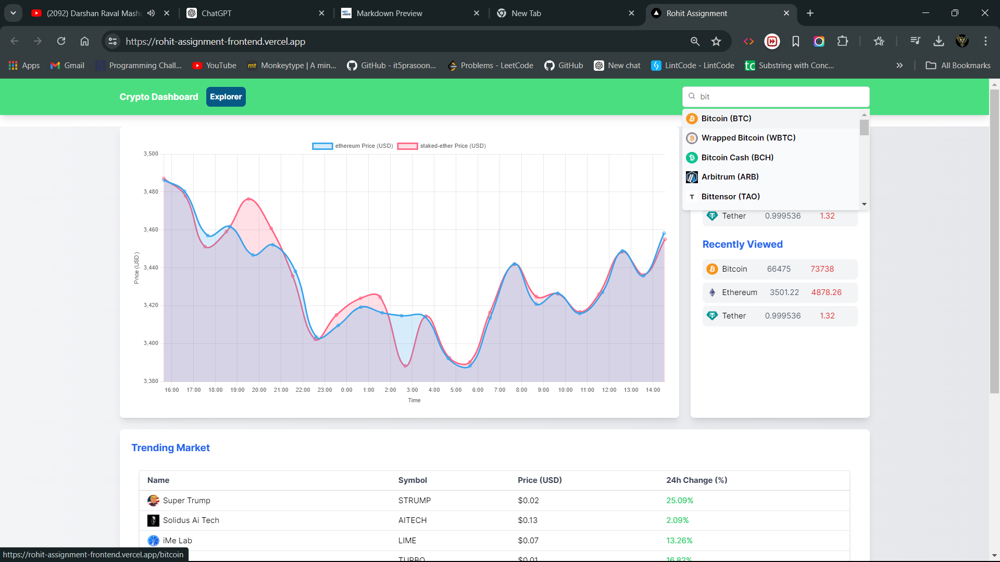
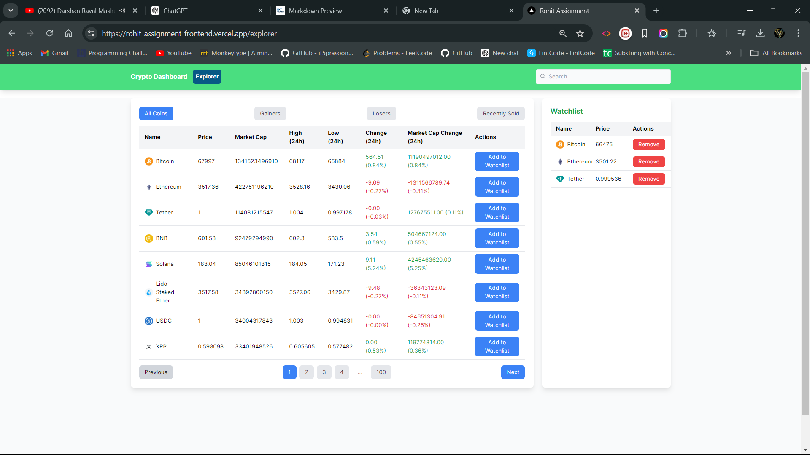
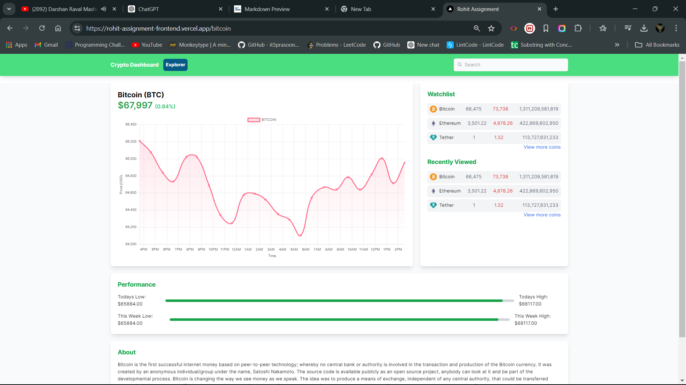

# Project Submission: Cryptocurrency  Stock Market  Tracker Website

## Project Overview
This project is a web application for tracking cryptocurrencies, built using Next.js. It aims to provide real-time updates on cryptocurrency prices, detailed information on individual cryptocurrencies, and display global market trends.

## Objectives
1. Develop a user-friendly web application to track various cryptocurrencies.
2. Provide real-time updates on cryptocurrency prices.
3. Offer detailed information on individual cryptocurrencies, including historical data and market trends.

# Stock Market Dashboard

## Overview

This project is a Stock Market Dashboard application built with React, Redux, and Next.js. The app allows users to explore stock data, add stocks to their watchlist, and view detailed charts. It includes features like debounced and throttled search, pagination, and local storage for maintaining the user's state across sessions.

## Table of Contents

- [Features](#features)
- [Tech Stack](#tech-stack)
- [Folder Structure](#folder-structure)
- [Getting Started](#getting-started)
- [Usage](#usage)
- [Contributing](#contributing)
- [License](#license)

## Features

- **Search with Debouncing & Throttling**: Efficient search functionality implemented using debouncing and throttling to reduce the number of API calls.
- **Pagination**: Smooth pagination of stock data to improve performance and user experience.
- **Watchlist**: Add stocks to a watchlist and persist data using Redux and local storage.
- **Responsive Design**: Fully responsive UI built with CSS and modern layout techniques.
- **Dynamic Routing**: Dynamic routing using Next.js for seamless navigation between different stock details.
- **Data Visualization**: Interactive charts for stock data using a custom LineChart component.

## Tech Stack

- **Next.js**: For server-side rendering and routing.
- **React**: For building the UI components.
- **Redux**: For state management.
- **JavaScript (ES6+)**: Core programming language.
- **CSS**: Styling the application.
- **Local Storage**: Persisting the watchlist data.
- **Debouncing & Throttling**: Efficient handling of input search.
- **Pagination**: Efficient display of large datasets.

## Folder Structure

```plaintext
.
├── .next
├── app
│   ├── routes
│   │   └── [coinId]
│   ├── explorer
│   ├── layout.js
│   ├── page.js
│   ├── favicon.ico
│   ├── globals.css
│   ├── layout.js
│   ├── storeProvider.jsx
├── assets
│   ├── Coin_Details.png
│   ├── Explorer.png
│   ├── Home_se.png
│   ├── Home.png
├── components
│   ├── CryptoDashboar.js
│   ├── LineChart.js
│   ├── Loader.js
│   ├── Navbar.js
│   ├── Pagination.js
├── node_modules
├── public
├── redux
│   ├── slices
│   │   ├── coinSlice.js
│   │   ├── watchlistSlice.js
│   ├── hooks.js
│   ├── store.js
├── .eslintrc.json

```

### Folder Descriptions

- **app/routes**: Contains dynamic routes, like `[coinId]` for individual stock details.
- **app/explorer**: Components related to the stock explorer functionality.
- **assets**: Images and static assets used in the application.
- **components**: Reusable React components such as the dashboard, charts, loader, navbar, and pagination.
- **redux/slices**: Redux slices for state management, including `coinSlice.js` and `watchlistSlice.js`.
- **redux/hooks.js**: Custom hooks for Redux state management.
- **redux/store.js**: Redux store configuration.

### Getting Started

#### Prerequisites

- Node.js v14.x or higher
- npm or yarn

## Installation

Follow these steps to set up the Cryptonite application on your local machine:

1. **Clone the Repository:**

    ```bash
    git clone https://github.com/Rohitrky2021/Rohit_Assignment.git
    ```

2. **Navigate to the Project Directory:**

    ```bash
    cd Rohit_Assignment
    ```

3. **Install Dependencies:**

    Install the necessary dependencies for the project:

    ```bash
    npm install
    ```

4. **Run the Development Server:**

    Start the Next.js development server:

    ```bash
    npm run dev
    ```

    After running this command, the application will be available locally at [http://localhost:3000](http://localhost:3000).

# Features & Overview of the Website 

### 1. Homepage
- **Global Market Cap Chart:** Display a line or candle graph showing the global market cap data for cryptocurrencies.
- **Public Companies Holdings:** Display information about public companies holding Bitcoin and Ethereum.

#### Homepage Images



### 2. Explore Page
- **Paginated Coin List/Grid:** Display a paginated list or grid of cryptocurrencies, with each page containing 20 items and navigation to load more.
- **Navigation:** Clicking on a card routes the user to the product page of the selected cryptocurrency.

#### Explore Page Image


### 3. Product Page
- **Basic Information:** Display basic information about the selected cryptocurrency.
- **Price Graph:** Show a candle or line graph of the cryptocurrency’s price over time.

#### Product Page Image



### 4. Common Header
- **Application Name:** Display the name of the application.
- **Search Bar:** Include a search bar that shows suggested cryptocurrencies as the user types.
 
## API Integration
- **Primary API:** CoinGecko API for fetching real-time data and historical data.
- **Additional APIs:** Use additional APIs to fetch data on public companies holding Bitcoin and Ethereum (if required).

## Development Considerations
- **API Key:** Ensure to generate an API key and check the limits on requests per minute and per day.
- **State Management:** Use any state management library (Redux/Redux Toolkit, Zustand, Jotai).
- **Loading, Error, and Empty States:** Handle loading, error, and empty states appropriately.
- **Folder Structure:** Follow a standard, well-defined folder structure.
- **Responsive Design:** Ensure the UI is responsive and supports multiple screen sizes.
- **Deployment:** Deploy the working code on any website hosting platform (GitHub, Vercel, Netlify, Firebase).
- **Third-Party Libraries:** Avoid using utility libraries such as underscore.js, lodash, day.js.
- **Graph Libraries:** You can use a third-party library for line graphs.
- **Caching:** Cache API responses (with expiration) for all the pages.
- **UI Creativity:** Explore and use creativity to come up with a unique yet usable UI.

## Brownie Points
 - **Server-Side Rendering:** Utilize Next.js's server-side rendering capabilities.
- **Search Bar Suggestions:** Integrate a feature in the search bar to display recently searched items as suggestions.
- **Mock Live Price Ticker:** Simulate a live price ticker using a Pub-Sub mechanism, providing real-time updates on the product page.
 
## Frequently Asked Questions (FAQ)

### API and Data Handling
**Q: What happens if the API request limit is reached?**
- If the API request limit is reached, the website may temporarily stop fetching new data until the limit resets. You may see a message indicating that the API limit has been reached and suggesting you try again later.

 
**Q: What are the common API errors and rate limits?**
- Common API errors include exceeding the rate limit, invalid API keys, and network issues. Each API provider has specific rate limits, which are typically documented on their website.

 
## Useful Links
- [CoinGecko API Documentation](https://docs.coingecko.com/reference/introduction)
- [Setting Up Your API Key](https://docs.coingecko.com/reference/setting-up-your-api-key)
- [Common Errors and Rate Limits](https://docs.coingecko.com/reference/common-errors-rate-limit)

ThankYou !
